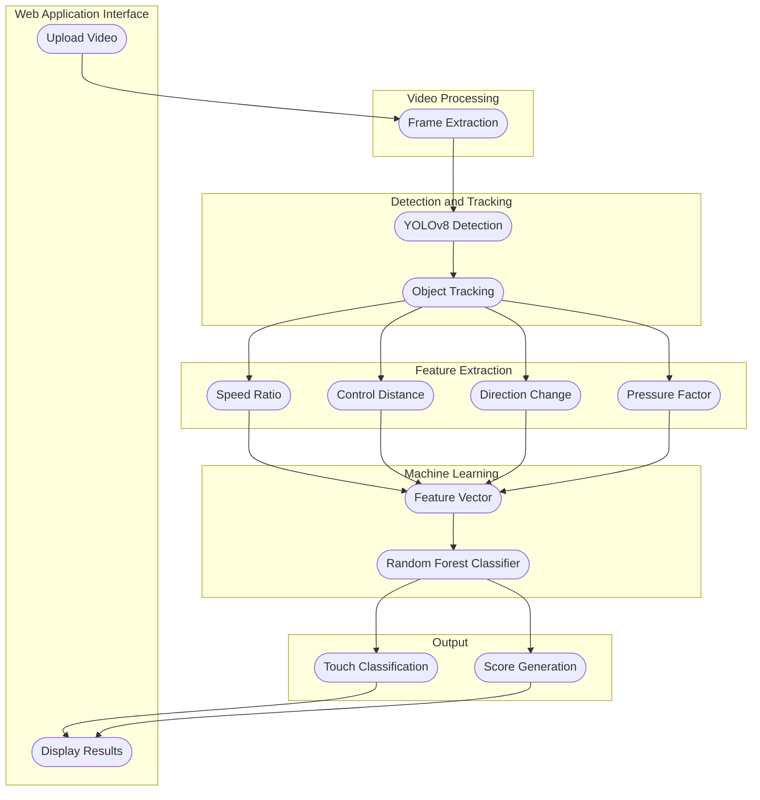

# Smart Analysis of Football First Touch Using Computer Vision

This project analyzes a football player's first touch from uploaded video and classifies touch quality using computer vision and machine learning.

## Objective

Build an end-to-end pipeline that:
1. Reads player video.
2. Detects and tracks the ball/player interaction.
3. Extracts first-touch behavior features.
4. Classifies touch quality.
5. Generates an interpretable score for coaches and players.

## End-to-End Workflow

1. Video Processing: extract frames from uploaded video.
2. Detection and Tracking: run YOLOv8 detection and object tracking.
3. Feature Extraction: compute speed ratio, control distance, direction change, and pressure factor.
4. Machine Learning: assemble feature vector and run Random Forest classifier.
5. Output: generate touch class and quality score.
6. Web Application Interface: upload video and display analysis results.

## Architecture Snapshot



## Features Used by the Classifier

- `speed_ratio`: ratio of ball speed change around first contact.
- `control_distance`: distance between player and ball after touch.
- `direction_change`: angle or vector change after touch.
- `pressure_factor`: local pressure estimate from surrounding players/space.

## Predicted Classes

- `Good touch`
- `Poor touch`
- `Pressure touch`

## Suggested Tech Stack

- Detection: YOLOv8 (`ultralytics`)
- Tracking: ByteTrack/DeepSORT (or equivalent tracker)
- ML Classifier: Random Forest (`scikit-learn`)
- UI: React (Vite) frontend + Flask API backend
- Data Processing: OpenCV, NumPy, Pandas

## Recommended Project Structure

```text
project/
|-- data/
|-- models/
|-- notebooks/
|-- src/
|   |-- video_processing/
|   |-- detection_tracking/
|   |-- feature_extraction/
|   |-- ml/
|   `-- app/
|-- architecture.md
`-- README.md
```

## High-Level Run Steps

1. Install required Python packages.
2. Place trained YOLOv8 weights and Random Forest model in `models/`.
3. Start backend API and frontend web app.
4. Upload a football video.
5. Review touch class, score, and feature-level explanation.

## Notes

- This documentation defines the target football first-touch pipeline architecture.
- For detailed component design, see [architecture.md](./architecture.md).
