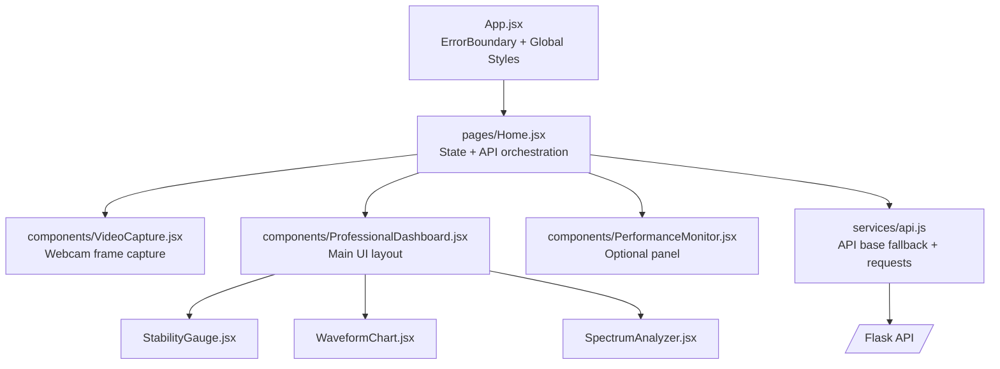
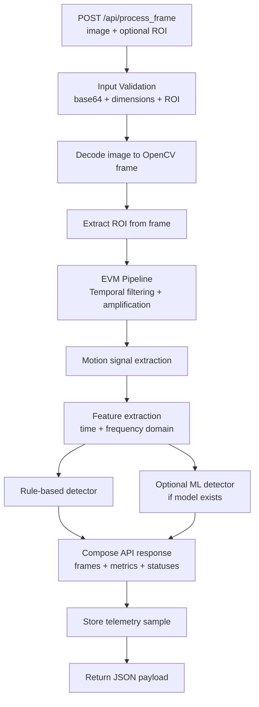
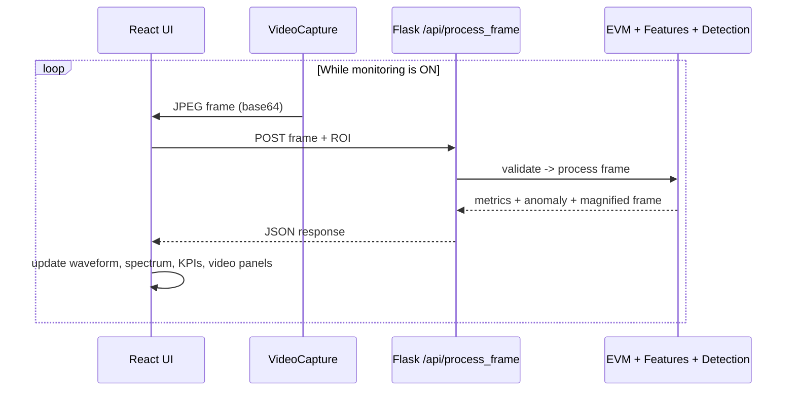
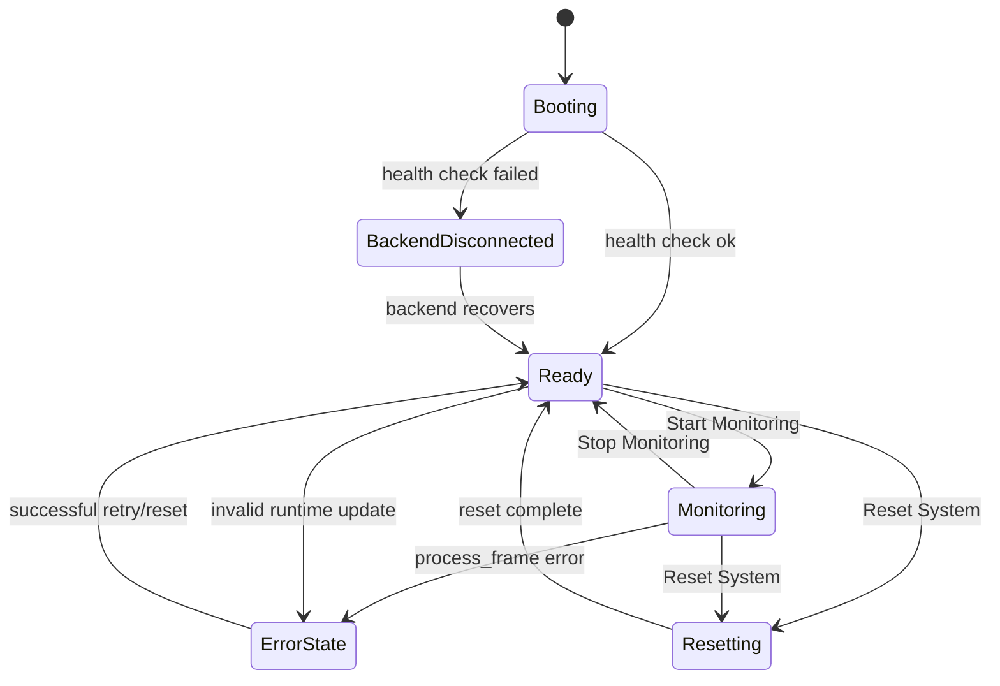
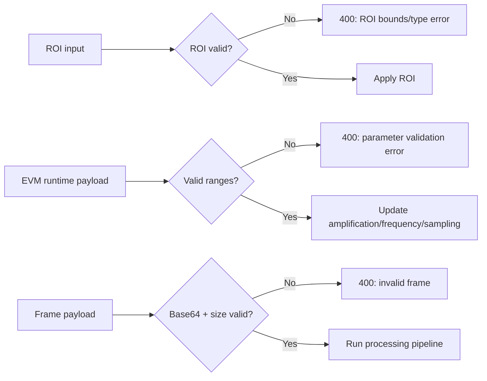
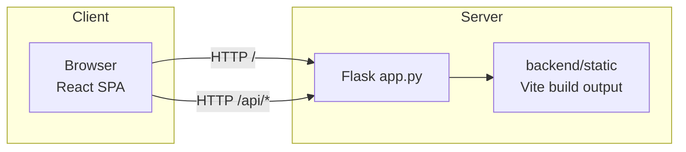
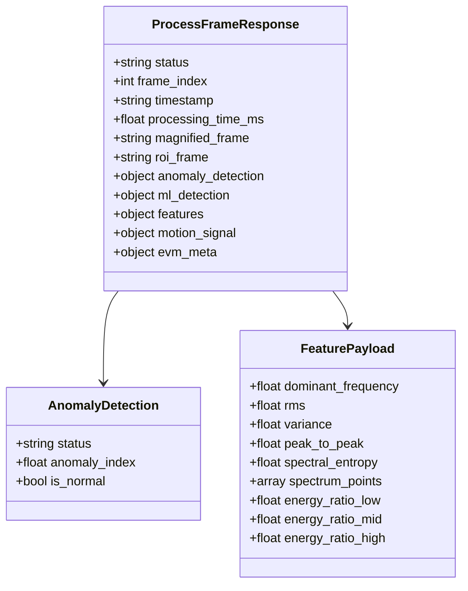

# Microanomalies Detection Architecture

This document describes the current, working architecture of the system with Mermaid diagrams and plain-language explanations.

## 1) System Context

```mermaid
flowchart LR
    User[Operator in Browser]\nReactApp[React Frontend\nVite Build]
    Camera[Webcam\nMediaDevices API]
    Flask[Flask API\nbackend/app.py]
    EVM[Motion Pipeline\nEVM + Signal + Features]
    Detectors[Anomaly Detectors\nRule-based + Optional ML]
    Telemetry[Telemetry Store\nIn-memory history + aggregates]

    User --> ReactApp
    Camera --> ReactApp
    ReactApp -->|POST /api/process_frame| Flask
    ReactApp -->|GET /api/health\nGET /api/runtime/evm\nPOST /api/runtime/evm\nPOST /api/roi\nPOST /api/reset| Flask
    Flask --> EVM
    EVM --> Detectors
    Detectors --> Flask
    Flask --> Telemetry
    Telemetry --> Flask
    Flask --> ReactApp
```

Explanation:
- The browser captures webcam frames and sends them to the Flask API.
- Flask runs EVM motion magnification, feature extraction, and anomaly scoring.
- Results are returned to React for live charts, status cards, and controls.
- Telemetry is persisted in memory for summary and trend endpoints.

## 2) Frontend Component Architecture



Explanation:
- `Home.jsx` is the state container for monitoring state, runtime settings, errors, and chart data.
- `VideoCapture` captures frames on an interval and pushes them to `Home`.
- `ProfessionalDashboard` renders video outputs, KPI cards, controls, and charts.
- `api.js` handles endpoint fallback (`/api`, localhost variants) and response validation.

## 3) Backend Processing Pipeline



Explanation:
- Validation is done before expensive compute steps.
- ROI extraction limits processing to the selected area.
- The response includes magnified frame, ROI frame, feature metrics, anomaly status, and timing.

## 4) Live Monitoring Sequence



Explanation:
- The frame loop is controlled in the frontend (`isMonitoring`).
- Each successful response updates all real-time widgets.
- If validation fails, API returns a 400 error and UI shows an error banner.

## 5) Monitoring Lifecycle State Machine



Explanation:
- The UI can start/stop monitoring only when backend health is good.
- Errors are recoverable through retry or reset.
- Reset clears runtime buffers/history and returns to a clean state.

## 6) Validation Rules



Key enforced ranges:
- ROI: `x >= 0`, `y >= 0`, `50 <= width <= 640`, `50 <= height <= 480`
- Amplification: `1..100`
- Frequency band: `0.1 <= low <= 120`, `0.2 <= high <= 150`, and `high > low`
- Sampling rate: `1..240 FPS`

## 7) Deployment View



Explanation:
- In production, Flask serves the built frontend and API from one host.
- In development, Vite dev server can proxy `/api` to Flask.

## 8) Data Contract (Core Response)



Explanation:
- The frontend depends on this payload for charts, metric cards, and status badges.
- `spectrum_points` powers FFT visualization.
- `anomaly_detection` and timing fields drive operational decisions.
