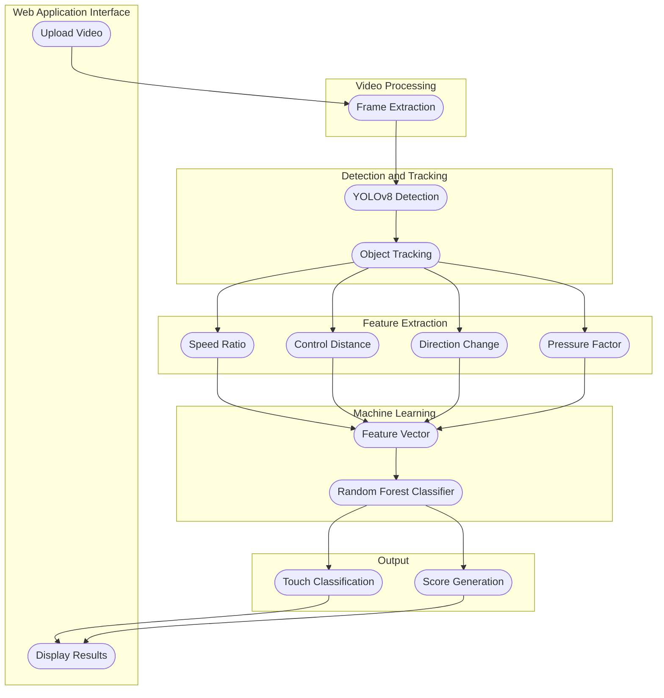

# Architecture: Smart Analysis of Football First Touch Using Computer Vision

## 1. Architecture Goal

Design an end-to-end system that converts raw football video into first-touch quality decisions and scores through detection, tracking, feature engineering, and classification.

## 2. System Diagram



## 3. Component Breakdown

### 3.1 Video Processing

Responsibility:
- Decode uploaded video.
- Extract ordered frames with timestamp metadata.

Input:
- User-uploaded video file.

Output:
- Frame stream `F(t)` with frame index and time.

### 3.2 Detection and Tracking

Responsibility:
- Detect ball and relevant entities using YOLOv8.
- Track detected objects across frames to produce stable trajectories.

Input:
- Frame stream `F(t)`.

Output:
- Tracklets with IDs and frame-wise coordinates.

### 3.3 Feature Extraction

Responsibility:
- Compute event-level first-touch descriptors from trajectories.

Feature definitions:
- `speed_ratio`: pre-touch vs post-touch speed relation.
- `control_distance`: post-touch ball control proximity.
- `direction_change`: directional deviation caused by touch.
- `pressure_factor`: contextual pressure around the touch event.

Output:
- Feature vector `X = [speed_ratio, control_distance, direction_change, pressure_factor]`.

### 3.4 Machine Learning

Responsibility:
- Use Random Forest to classify touch quality from engineered features.

Input:
- Feature vector `X`.

Output:
- Class label and confidence distribution.

Class labels:
- `Good touch`
- `Poor touch`
- `Pressure touch`

### 3.5 Output Layer

Responsibility:
- Convert model outputs into user-facing decision and score.

Outputs:
- `touch_classification`
- `score_generation` (normalized quality score)

### 3.6 Web Application Interface

Responsibility:
- Provide user workflow from upload to visualization through frontend + backend API.

User actions:
- Upload video.
- View results with class, score, and feature explanation.

## 4. Data Contracts

### 4.1 Detection Record

```json
{
  "frame_id": 128,
  "timestamp_sec": 4.267,
  "object": "ball",
  "bbox": [x1, y1, x2, y2],
  "confidence": 0.94,
  "track_id": 7
}
```

### 4.2 Feature Vector Record

```json
{
  "video_id": "clip_001",
  "touch_id": 12,
  "speed_ratio": 0.81,
  "control_distance": 0.44,
  "direction_change": 26.7,
  "pressure_factor": 0.69
}
```

### 4.3 Inference Output Record

```json
{
  "touch_classification": "Good touch",
  "score": 0.91,
  "class_probabilities": {
    "Good touch": 0.91,
    "Poor touch": 0.06,
    "Pressure touch": 0.03
  }
}
```

## 5. Training and Inference Flow

### 5.1 Offline Training

1. Prepare labeled first-touch dataset.
2. Run detection and tracking to build trajectories.
3. Generate feature vectors.
4. Train Random Forest classifier.
5. Save model artifact and feature schema.

### 5.2 Online Inference

1. User uploads video in the web interface.
2. System runs frame extraction and tracking pipeline.
3. System computes features.
4. Classifier predicts touch class and score.
5. UI shows result panels and charts.

## 6. Evaluation Metrics

- Classification accuracy
- Macro F1 score
- Per-class precision/recall
- Confusion matrix
- Feature importance ranking (Random Forest)

## 7. Engineering Notes

- Keep class labels balanced during training.
- Validate tracker stability before feature extraction.
- Freeze feature schema and order for reproducible inference.
- Version model files with metadata (`model_version`, `feature_version`, `date`).

## 8. Scope Statement

This architecture document is the source of truth for the football first-touch pipeline shown in the project diagram and should stay synchronized with future implementation updates.
