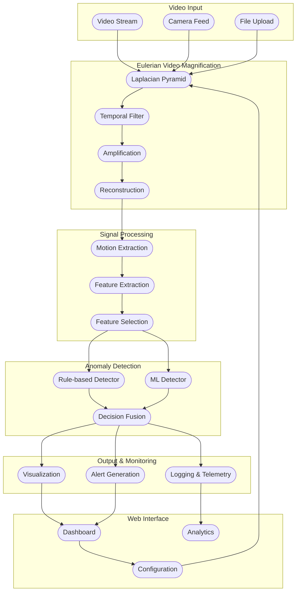

# Architecture: Microanomalies Detection System Using Eulerian Video Magnification

## 1. Architecture Goal

Design an end-to-end system that converts raw video streams into amplified motion visualizations and detects subtle anomalies through Eulerian Video Magnification, signal processing, and intelligent anomaly detection algorithms.

## 2. System Diagram



## 3. Component Breakdown

### 3.1 Video Input Processing

Responsibility:
- Handle multiple video input sources (files, streams, camera feeds).
- Decode video and extract frames with timestamp metadata.
- Preprocess frames for EVM pipeline.

Input:
- Video files, live streams, or camera feeds.

Output:
- Frame stream `F(t)` with frame index and timestamp.

### 3.2 Eulerian Video Magnification (EVM)

Responsibility:
- Amplify subtle motions using spatial-temporal processing.
- Apply Laplacian pyramid decomposition for spatial frequency separation.
- Use temporal band-pass filtering to isolate motion frequencies.
- Reconstruct amplified video frames.

Input:
- Frame stream `F(t)`.

Output:
- Amplified frame stream `F_amplified(t)`.

Configuration:
- Number of pyramid levels
- Amplification factor
- Frequency bounds (low/high)
- Chroma attenuation

### 3.3 Signal Processing

Responsibility:
- Extract motion signals from amplified video.
- Compute meaningful features from motion patterns.
- Apply noise reduction and signal enhancement.

Input:
- Amplified frame stream `F_amplified(t)`.

Output:
- Feature vectors for anomaly detection.

Features:
- Motion magnitude and direction
- Frequency domain characteristics
- Spatial motion patterns
- Temporal evolution metrics

### 3.4 Anomaly Detection

Responsibility:
- Detect anomalies using hybrid rule-based and ML approaches.
- Fuse decisions from multiple detection algorithms.
- Generate confidence scores and alerts.

Input:
- Feature vectors from signal processing.

Output:
- Anomaly classifications with confidence scores.

Detection Methods:
- Rule-based threshold detection
- Machine learning classifiers
- Ensemble decision fusion
- Real-time alert generation

### 3.5 Output & Monitoring

Responsibility:
- Generate visualization outputs and alerts.
- Log system telemetry and performance metrics.
- Store historical data for analytics.

Outputs:
- Amplified video streams
- Anomaly alerts and classifications
- System telemetry data
- Analytics datasets

### 3.6 Web Interface

Responsibility:
- Provide interactive dashboard for system control and monitoring.
- Display real-time video processing results.
- Enable configuration adjustments and ROI selection.

User Interface:
- Real-time video visualization
- Configuration panels
- Analytics dashboards
- Alert management system

## 4. Data Contracts

### 4.1 Video Frame Record

```json
{
  "frame_id": 128,
  "timestamp_sec": 4.267,
  "width": 1920,
  "height": 1080,
  "fps": 30.0,
  "format": "RGB"
}
```

### 4.2 EVM Processing Record

```json
{
  "frame_id": 128,
  "processing_timestamp": "2024-01-15T10:30:45Z",
  "pyramid_levels": 4,
  "amplification_factor": 10.0,
  "low_freq": 0.4,
  "high_freq": 3.0,
  "processing_time_ms": 45.2
}
```

### 4.3 Feature Vector Record

```json
{
  "video_id": "stream_001",
  "timestamp_sec": 4.267,
  "motion_magnitude": 0.81,
  "frequency_peak": 2.3,
  "spatial_variance": 0.44,
  "temporal_gradient": 0.67,
  "roi_id": "primary_region"
}
```

### 4.4 Anomaly Detection Record

```json
{
  "detection_id": "anom_001",
  "timestamp_sec": 4.267,
  "anomaly_type": "motion_spike",
  "confidence": 0.91,
  "severity": "high",
  "rule_based_score": 0.85,
  "ml_score": 0.94,
  "fused_score": 0.91,
  "features": {
    "motion_magnitude": 0.81,
    "frequency_peak": 2.3,
    "spatial_variance": 0.44
  }
}
```

## 5. Training and Inference Flow

### 5.1 Offline Training

1. Collect labeled video datasets with anomaly annotations.
2. Apply EVM processing to extract amplified motion features.
3. Extract comprehensive feature vectors from amplified video.
4. Train ML models (Random Forest, SVM, Neural Networks) on labeled data.
5. Validate model performance using cross-validation.
6. Optimize rule-based thresholds using statistical analysis.
7. Save model artifacts and feature schemas.

### 5.2 Online Inference

1. User uploads video or starts live stream in web interface.
2. System runs EVM pipeline to amplify subtle motions.
3. Signal processing extracts real-time features.
4. Hybrid anomaly detection (rule-based + ML) analyzes features.
5. Decision fusion generates final anomaly classifications.
6. UI displays amplified video, alerts, and analytics in real-time.

### 5.3 Continuous Learning

1. Collect user feedback on anomaly detections.
2. Periodically retrain models with new labeled data.
3. Update rule-based thresholds based on performance metrics.
4. Deploy updated models using A/B testing.

## 6. Evaluation Metrics

### 6.1 Anomaly Detection Metrics
- **Accuracy**: Overall classification accuracy
- **Precision/Recall**: Per-class anomaly detection performance
- **F1-Score**: Harmonic mean of precision and recall
- **ROC-AUC**: Area under ROC curve for binary classification
- **Confusion Matrix**: Detailed classification breakdown

### 6.2 System Performance Metrics
- **Processing Latency**: End-to-end processing time per frame
- **Throughput**: Frames processed per second
- **Memory Usage**: RAM consumption during processing
- **CPU/GPU Utilization**: Resource utilization metrics
- **Detection Delay**: Time from anomaly occurrence to alert

### 6.3 EVM Quality Metrics
- **Motion Amplification Quality**: Signal-to-noise ratio improvement
- **Frequency Response**: Accuracy of temporal filtering
- **Spatial Reconstruction**: Image quality after pyramid reconstruction
- **Artifact Level**: Unwanted visual artifacts introduced

## 7. Engineering Notes

### 7.1 Performance Optimization
- Optimize Laplacian pyramid computation using GPU acceleration
- Implement circular buffers for temporal filtering to reduce memory usage
- Use multi-threading for parallel frame processing
- Cache frequently accessed configuration parameters

### 7.2 Reliability Considerations
- Implement graceful degradation for high-load scenarios
- Add comprehensive error handling for video input failures
- Use circuit breakers for external service dependencies
- Implement health checks for all system components

### 7.3 Scalability Design
- Design stateless API endpoints for horizontal scaling
- Use message queues for asynchronous processing pipelines
- Implement data partitioning for large-scale video storage
- Consider microservices architecture for component isolation

### 7.4 Security Considerations
- Validate all video inputs for malicious content
- Implement rate limiting for API endpoints
- Use secure authentication for configuration changes
- Encrypt sensitive telemetry data

## 8. Configuration Management

### 8.1 EVM Parameters
```python
EVM_CONFIG = {
    "num_levels": 4,              # Pyramid decomposition levels
    "amplification": 10.0,        # Motion amplification factor
    "low_freq": 0.4,             # Low frequency cutoff (Hz)
    "high_freq": 3.0,            # High frequency cutoff (Hz)
    "sampling_rate": 30.0,       # Video frame rate (Hz)
    "chroma_attenuation": 0.1    # Color channel attenuation
}
```

### 8.2 Detection Parameters
```python
ANOMALY_CONFIG = {
    "threshold": 0.7,            # Anomaly detection threshold
    "window_size": 100,          # Analysis window size (frames)
    "ml_model": "random_forest", # Primary ML algorithm
    "ensemble_weights": {        # Decision fusion weights
        "rule_based": 0.4,
        "ml_based": 0.6
    }
}
```

## 9. Scope Statement

This architecture document serves as the source of truth for the Microanomalies Detection System using Eulerian Video Magnification. It should remain synchronized with implementation updates and guide future development decisions.

### 9.1 In Scope
- Real-time video processing with EVM
- Hybrid anomaly detection (rule-based + ML)
- Web-based dashboard and configuration interface
- Docker-based deployment and scaling
- Comprehensive monitoring and telemetry

### 9.2 Out of Scope
- Audio processing and analysis
- Multi-camera synchronization
- Cloud-specific deployment optimizations
- Real-time streaming protocol implementation
- Mobile application development

## 10. Version History

- **v1.0** - Initial architecture design (January 2024)
- **v1.1** - Added hybrid detection approach (February 2024)
- **v1.2** - Enhanced performance optimization strategies (March 2024)
